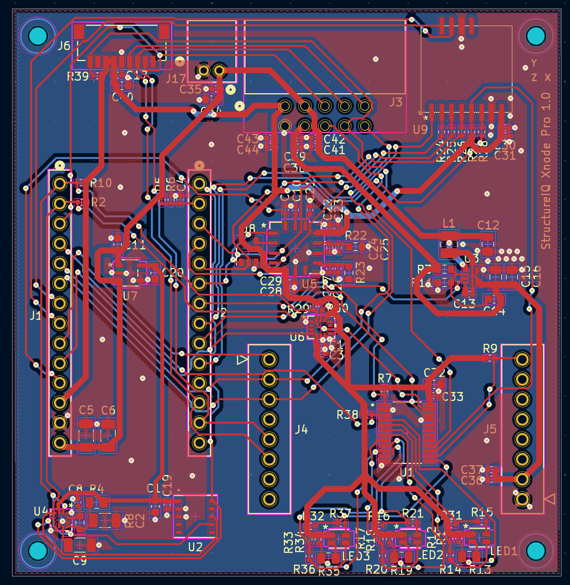
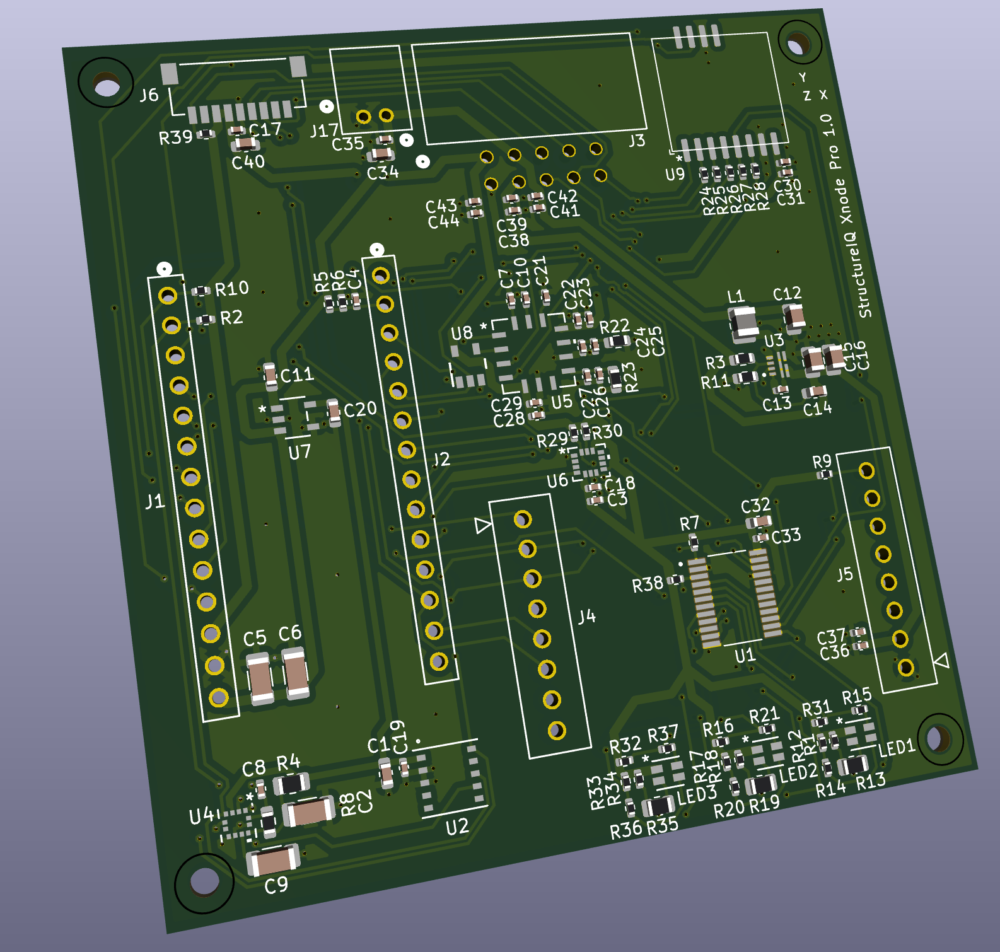

# 🛰️ StructureIQ Xnode

The **StructureIQ Xnode** is a wireless sensor node built for long-term monitoring of real-world infrastructure such as bridges, buildings, and other large structures.

As **Lead Hardware Engineer** at StructureIQ, I owned the hardware development for this product end-to-end.

This repo is not a full design archive or schematic release because the product is active company IP. Instead, it gives a high-level look at the board I designed, what the node does, and what it was like owning the hardware side of the product.

---

## 🎯 What it does

- **Captures high-quality structural data.** The node measures real physical behavior from infrastructure over time, giving engineers insight into how a structure is performing instead of simply whether it has visibly failed.
- **Designed for long-term field deployment.** Built for real infrastructure environments with difficult installation locations, battery-powered operation, exposure to weather, and deployments expected to last years.
- **Wireless monitoring at scale.** Multiple nodes can be deployed across a structure without extensive sensor cabling, making large-area coverage practical.
- **Supports early detection of problems.** The system is designed to identify signs of degradation before they become major failures, allowing maintenance and planning decisions to happen earlier.
- **Built with deployment in mind.** The form factor, connectors, and status indicators were designed so field technicians can install and validate the system without specialized hardware knowledge.

---

## 🧑‍🔧 What I worked on

I was the sole hardware owner for this product. That included system architecture, schematic design, multi-layer PCB layout, component selection, supplier coordination, board bring-up, debugging, and validation.

There was no senior EE above me to hand problems to, so the role required learning quickly, reading datasheets carefully, validating assumptions on the bench, and troubleshooting methodically.

The experience taught me to think "does it work right now? if yes, why, and how could this not work in the future?" 

---

## 🖼️ The board

### 🔴 PCB layout

### 🟢 3D render

---
